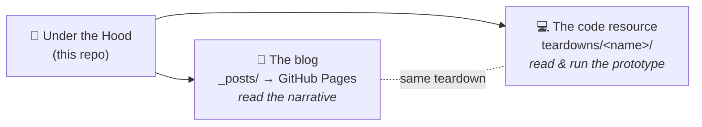
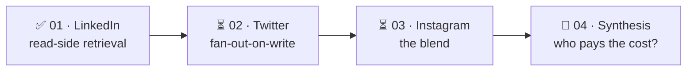

<div align="center">

# 🔩 Under the Hood

### What's really happening inside the systems you use every day — reconstructed, and rebuilt small enough to run.

Most "how X works" posts stop at a box diagram. **These don't.** Each teardown goes down to the
algorithms, data structures, and the exact tradeoffs — reconstructed from a company's public
engineering blog — and ships a **small runnable prototype** you can read in one sitting.

<br/>

[](https://github.com/jkaus324/engineering-systems/stargazers)
[](./LICENSE)
[](./CONTRIBUTING.md)

[](./teardowns/fishdb/code)
[](https://chirpy.cotes.page/)
[](#%EF%B8%8F-the-honesty-rule)

<br/>

[**📖 Read the blog**](https://jkaus324.github.io/engineering-systems) &nbsp;·&nbsp;
[**🗺️ The series arc**](./SERIES.md) &nbsp;·&nbsp;
[**➕ Suggest a teardown**](./NEW_TEARDOWN.md) &nbsp;·&nbsp;
[**🚀 Run the code**](#-run-any-prototype-in-30-seconds)

<sub>⭐ New teardowns land here regularly — star the repo to follow along.</sub>

</div>

---

## 💡 The idea in 5 seconds

> You use these systems every day. This repo opens them up — *one system at a time* — and rebuilds
> the core mechanism small enough that you can **read it, run it, and break it** in an afternoon.

Every teardown does the same four things:

- 🧩 **Starts from the problem** and builds the architecture up *one decision at a time*.
- 🔬 **Names the algorithm underneath** — inverted index, scatter-gather, fan-out — and explains *why* it's efficient.
- 💻 **Ships a runnable prototype** — not a production clone, just the core idea you can execute.
- 🧾 **Stays honest** — inferred from public sources, always cited, never claiming to be anyone's real code.

---

## 📚 The teardowns

| # | System | Company | The core idea | 📖 Read | 💻 Run |
|:--:|--------|---------|---------------|:------:|:-----:|
| **01** | **FishDB** — feed retrieval engine | LinkedIn | Graph-anchored retrieval: an inverted index + scatter-gather over 48 shards. You post, nothing moves; **readers pull it** at query time. | [Post](https://jkaus324.github.io/engineering-systems/posts/how-linkedin-built-its-feed/) · [Deep dive](./teardowns/fishdb/DESIGN.md) | [`fishdb/`](./teardowns/fishdb/) |
| 02 | *Twitter timelines* | Twitter / X | Fan-out-on-write & the celebrity problem | *planned* → [roadmap](./SERIES.md) | — |
| 03 | *Instagram Explore* | Meta | The blend, and ranking as the center of gravity | *planned* | — |
| 04 | *Who pays the cost?* | — | The synthesis: write-side vs. read-side as **one** design axis | *planned* | — |

> 🧭 The series is built to climb toward **Teardown 04** — a synthesis where the individual systems
> stop being the subject and become *evidence* for one mental model. The full arc is in
> [`SERIES.md`](./SERIES.md).

---

## ⭐ Featured · Teardown 01 — LinkedIn FishDB

> **The hook:** YouTube optimizes watch time. Instagram optimizes discovery. LinkedIn optimizes
> *graph relevance* — and that one difference changes the entire engineering. When you post, nothing
> is sent anywhere; it's filed under your name, and **readers pull it** when they open the app.

<details>
<summary><b>What you'll learn (click to expand)</b></summary>

<br/>

- Inverted vs. forward indexes — and why you need *both*
- The timeline record `(actor, verb, object)` — and why the actor becomes a search term
- Scatter-gather over shards + replicas, and why the slowest shard sets your latency
- One-writer-per-shard, the rule that buys lock-free reads
- Lambda ingestion (Kafka for fresh + HDFS for bulk)
- Per-shard top-K with a heap, and the broker's k-way merge

</details>

| | |
|---|---|
| 📖 **Blog post** | [How LinkedIn Built Its Feed to Answer You in 40 Milliseconds](https://jkaus324.github.io/engineering-systems/posts/how-linkedin-built-its-feed/) |
| 🧠 **Deep-dive design doc** | [`teardowns/fishdb/DESIGN.md`](./teardowns/fishdb/DESIGN.md) — problem → requirements → HLD → flows → rationale |
| 💻 **Runnable prototype (Java)** | [`teardowns/fishdb/code/`](./teardowns/fishdb/code/) |

```bash
cd teardowns/fishdb/code
javac fishdb/*.java
java fishdb.Main        # scripted walkthrough — one query, narrated end to end
java fishdb.Main -i     # interactive — type your own queries and watch retrieval happen live
```

<sub>Source: [LinkedIn Engineering — FishDB](https://www.linkedin.com/blog/engineering/infrastructure/fishdb-a-generic-retrieval-engine-for-scaling-linkedins-feed). A reconstruction, not LinkedIn's code.</sub>

---

## 🪞 One repo, two faces

This repo is a **blog** *and* a **browsable code resource** at the same time — pick whichever way you
like to learn.



| If you want to… | Go to… |
|-----------------|--------|
| 📖 **Read the story** of how a system works | the [blog](https://jkaus324.github.io/engineering-systems) (rendered from `_posts/`) |
| 🧠 **Go deeper** — requirements, HLD, sequence diagrams | the teardown's `DESIGN.md` |
| 💻 **Run the mechanism** yourself | the teardown's `code/` folder |

Adding a teardown means adding **one post + one `teardowns/<name>/` folder** — nothing else moves.

<details>
<summary><b>📁 Full repo layout (click to expand)</b></summary>

```
engineering-systems/
├── README.md              ← you are here (the hub)
├── SERIES.md              ← the planned multi-post arc
├── NEW_TEARDOWN.md        ← template + checklist for the next teardown
├── CONTRIBUTING.md        ← hosting setup + how to contribute
│
├── _posts/                ← published blog posts (one per teardown)   ─┐
├── _config.yml            ← Chirpy theme config                        │  the
├── Gemfile                ← Jekyll / Chirpy dependencies               ├─ GitHub Pages
├── _tabs/                 ← blog nav pages (About, …)                  │  blog
├── .github/workflows/     ← auto-build & deploy on push                ─┘
│
└── teardowns/             ← one self-contained folder per teardown     ─┐
    └── fishdb/                                                          │  the
        ├── README.md      ← this teardown's local hub                  ├─ code
        ├── DESIGN.md      ← the deep-dive design doc                   │  resource
        └── code/          ← runnable prototype                         ─┘
```

</details>

---

## 🚀 Run any prototype in 30 seconds

Each teardown's `code/` folder is **self-contained** — no shared build system, no monorepo tooling.
Clone, `cd`, run.

```bash
git clone https://github.com/jkaus324/engineering-systems.git
cd engineering-systems/teardowns/fishdb/code
javac fishdb/*.java && java fishdb.Main -i
```

> FishDB's prototype needs **JDK 21+** (it uses records and virtual threads) and **zero**
> dependencies. Future teardowns each state their own language + version in their folder's README.

---

## 🗺️ Roadmap



Each post stands alone **and** becomes a data point for the finale — where push-vs-pull turns out to
be a single design axis you can use to reason about *any* feed. Full reasoning in [`SERIES.md`](./SERIES.md).

---

## ⚖️ The honesty rule

These are **educational reconstructions inferred from public engineering blogs.** They are:

- ✅ Cited — every quantitative claim traces back to its public source.
- ✅ Flagged — anything inferred *beyond* the source is marked inline.
- ❌ **Not** affiliated with, endorsed by, or containing source code from any company discussed.

If a detail here disagrees with the original source, **trust the source** — and please
[open an issue](https://github.com/jkaus324/engineering-systems/issues) so it can be fixed.

---

## 🤝 Contributing

Corrections, and suggestions for systems to tear down next, are very welcome.

- 🐛 **Found an error?** [Open an issue](https://github.com/jkaus324/engineering-systems/issues) — trust the source over the reconstruction.
- ➕ **Want to add a teardown?** It's one post + one folder — see [`NEW_TEARDOWN.md`](./NEW_TEARDOWN.md).
- 🌐 **Hosting / setup?** The one-time GitHub Pages steps are in [`CONTRIBUTING.md`](./CONTRIBUTING.md).

---

<div align="center">

All trademarks belong to their respective owners. Prose & code in this repo: **MIT** — see [`LICENSE`](./LICENSE).

<sub>Built with curiosity. If a teardown taught you something, a ⭐ helps others find it.</sub>

</div>
