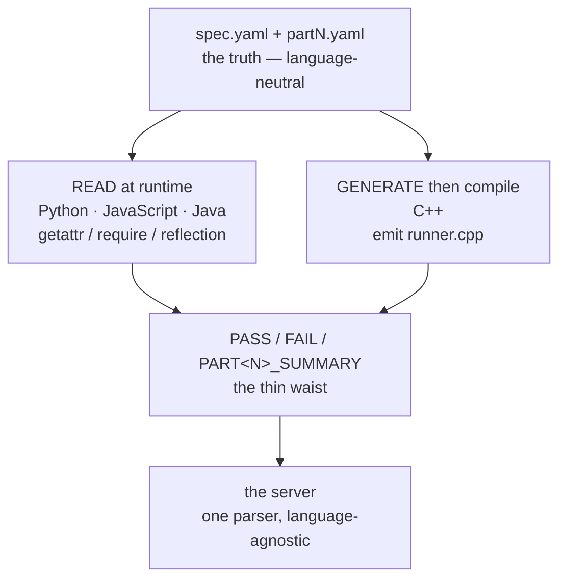

*A teardown of my own system — the judge behind [CodeJunction](https://topmate.io/jatin_kaushal24/2053177), a
machine-coding prep platform. The code here is real, lightly trimmed for readability.*

LeetCode grades your code. HackerRank grades your code. Every coding-practice site you've used has,
underneath the editor, a **judge**: take a solution, run it, decide pass or fail.

The editor is the part everyone sees. The judge is the part that decides whether the platform can
*scale*.

I run a machine-coding prep platform — **100+ problems**, each with 3 difficulty modes, each solvable
in multiple languages. Last week I added a fourth language, JavaScript, across all of them. The
naive version of that change is hundreds of new files. The version I actually shipped was **one
file**, and every one of them passed on the first full run.

This is how the judge pulls that off — and the one language where the whole approach falls apart and
I had to do something completely different.

## What the judge actually has to do

Strip away the editor and the difficulty modes, and one operation matters:

> Given a user's `solution` in language *L*, and a part number *N*, decide PASS or FAIL — and say
> which test cases failed.
{: .prompt-info }

That's the atom. Everything else is UI.

The obvious way to build it — the way I built it first — is to write a test file per problem, per
language: `part1_test.cpp`, `Part1Test.java`, `test_part1.py`. Each one imports the solution, calls
its methods, asserts on the output.

It works. It also doesn't scale, and the math shows why.

## Why the naive design collapses

Count the files. 100+ problems × the number of languages = hand-written test files, and the count
grows *every time you add a language*. Adding JavaScript the naive way meant authoring a new test file
for all 100+ problems. Hundreds of files, each one a place for a typo or a drifted assertion to hide.

But the deeper problem isn't the count — it's the **duplication of truth**.

> The expected answer to "rank these payment methods by cashback" is the *same fact* whether you check
> it in Python or Java. Write it four times and you maintain it four times — and let four copies
> silently disagree.
{: .prompt-warning }

The fix is the move that powers most things that scale: **separate the truth from the machinery that
runs it.**

## The problem describes itself

Every problem carries a `spec.yaml` — a language-neutral contract for what the problem *is*. Here's a
real one, trimmed:

```yaml
types:
  PaymentMethod:
    fields:
      - { name: name,           type: string }
      - { name: cashbackRate,   type: float }
      - { name: transactionFee, type: float }
      - { name: usageCount,     type: int }

functions:
  - name: rank_by_rewards
    params:
      - { name: methods, type: "list<PaymentMethod>" }
    returns: "list<PaymentMethod>"

parts:
  1: { name: "Single-criterion strategies", functions: [rank_by_rewards] }
```

That's the whole interface: the data shapes (`types`), the functions a solution must expose
(`functions`, with typed params), and which functions belong to which unlockable part. **No language
appears anywhere in it.**

The test cases live beside it, also as data — `tests/cases/part1.yaml`:

```yaml
- name: rewards_ranking
  call: rank_by_rewards
  args:
    - - { name: "UPI",           cashbackRate: 0.01, transactionFee: 0.0, usageCount: 1000 }
      - { name: "Credit Card A", cashbackRate: 0.05, transactionFee: 5.0, usageCount: 500 }
      - { name: "Credit Card B", cashbackRate: 0.10, transactionFee: 8.0, usageCount: 300 }
  expect_field: name
  expect: ["Credit Card B", "Credit Card A", "UPI"]
```

A test case is just: *which function to call, what arguments to build, what to expect back.* The
expected answer — Credit Card B ranks first — is written **once**, and it's true in every language
forever.

Now the real question: how do you turn that data into a *running test* in a language the YAML has
never heard of?

## The junction: read it, or generate it

Here's where it gets interesting, because there isn't one answer. There are two — and which one a
language gets is dictated by what the language can do at run time.

### For Python, JavaScript, and Java: read the spec, dispatch dynamically

These three languages can load a file, look up a function by its **string name**, and call it — no
compile step that has to know the function ahead of time. So each gets a *generic runner*, written
once, that reads `spec.yaml` + `partN.yaml`, loads the user's solution, and dispatches by name.

The dispatch is the same idea in each language:

```python
# Python — harness/python/runner.py
fn = getattr(solution, case["call"])   # look up the function by name
result = fn(*args)                      # call it
```

```javascript
// JavaScript — harness/javascript/runner.js
const fn = solution[testCase.call];    // look up by name
const result = fn(...args);            // call it
```

```java
// Java — harness/java/Runner.java  (reflection)
Method method = solCls.getDeclaredMethod(fnName, ...);
Object result = method.invoke(null, coerced);
```

Building the arguments is the same trick applied to data: a `list<PaymentMethod>` in the YAML becomes
a real `PaymentMethod` by calling the user's constructor with the fields **in declared order**. The
runner never names `PaymentMethod` in its own source — it learns the type from the spec and constructs
it reflectively (`getattr` in Python, the `require`'d exports in JS, `Class.forName` in Java).

> 💻 **Code point:** one generic runner per language — about 250 lines — reads the spec and dispatches
> by name. Adding a language in this family is *zero* per-problem work — the same idea lives in
> `harness/python/runner.py`, `harness/javascript/runner.js`, and `harness/java/Runner.java`.
{: .prompt-info }

### For C++: you can't read your way out — you generate

C++ has no `eval`, no built-in way to call a function from a string name, and no convenient runtime
YAML. The runtime-dispatch trick is simply *not available*. So C++ takes the opposite road: at submit
time, a small script reads the same `spec.yaml` + `partN.yaml` and **emits a `runner.cpp`** — real
C++ where each test case is unrolled into inline code:

```cpp
// generated — do not edit
auto _result = rank_by_rewards(std::vector<PaymentMethod>{
    PaymentMethod{"UPI", 0.01, 0.0, 1000},
    PaymentMethod{"Credit Card A", 0.05, 5.0, 500},
    PaymentMethod{"Credit Card B", 0.10, 8.0, 300}
});
// ... compare against {"Credit Card B", "Credit Card A", "UPI"} ...
```

Then it compiles that against the user's `solution.cpp` and runs it.

This is the junction:

> The same spec drives both paths — but the language's runtime capabilities decide whether you
> **interpret** the spec or **compile** it. Reflective, interpreted languages read it; a statically
> compiled language with no reflection gets code generated *for* it.
{: .prompt-tip }

One source of truth, two execution strategies, chosen by what the language can physically do.

## The thin waist that holds it together

Two execution models could easily mean two messes. They don't — because every runner, read-path or
generate-path, is forced to speak the same four-line output language:

```text
PASS rewards_ranking
PASS low_fee_ranking
FAIL trust_ranking
PART1_SUMMARY 2/3
```

`PASS <name>`, `FAIL <name>`, and `PART<N>_SUMMARY <passed>/<total>`. That's the entire contract. The
server parses those lines with one function and never learns *or cares* which language produced them.
Python `print`-ing `PASS`, C++ `std::cout`-ing `PASS`, Java `System.out.println`-ing `PASS` — all
identical on the wire.



This is the part that actually makes new languages cheap. The contract isn't "write tests like the
other languages do." The contract is "emit these four line shapes." Anything that can do that plugs
in.

## The payoff

Adding JavaScript to the platform was: write one ~250-line runner, add one boilerplate-stub emitter,
port the reference solutions. **No new test files. No expected outputs re-typed.** I ran all 100+
problems and every one passed on the first full sweep — because the expected answers were never
re-authored, only re-read.

Adding the *next* language is now a weekend, not a month:

- A reflective, interpreted language joins the **read path** and inherits everything.
- Another compiled language without reflection follows C++ down the **generate path**.

Either way, the problems don't change, the test cases don't change, and the truth stays written
exactly once.

> **You're not testing code in N languages. You're interpreting one spec, N ways.**
{: .prompt-tip }

That's the same lesson I try to teach *inside* the problems themselves: the interface you design
decides how much code you write next. Pick the boundary well — `spec.yaml` as the single source of
truth, four line-shapes as the output contract — and "support a new language" stops being a project
and becomes a file.

---

*This is a teardown of my own system — the judge behind CodeJunction, a machine-coding interview-prep
platform. Unlike the other posts in this series, it's not a reconstruction of someone else's
engineering: the spec format, the runners, and the C++ code generator are the real thing, trimmed for
readability.*

*The harness powers [CodeJunction](https://topmate.io/jatin_kaushal24/2053177) — the per-language
runners under `harness/<lang>/`, the per-problem `spec.yaml` contracts, and the YAML test cases each
runner consumes.*
